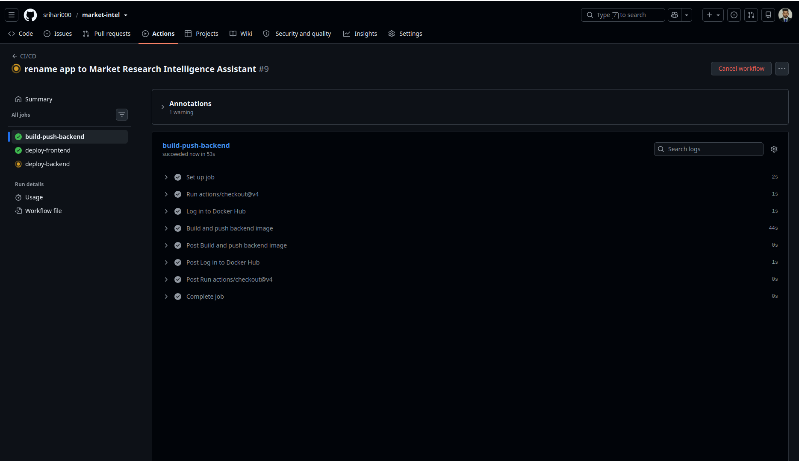
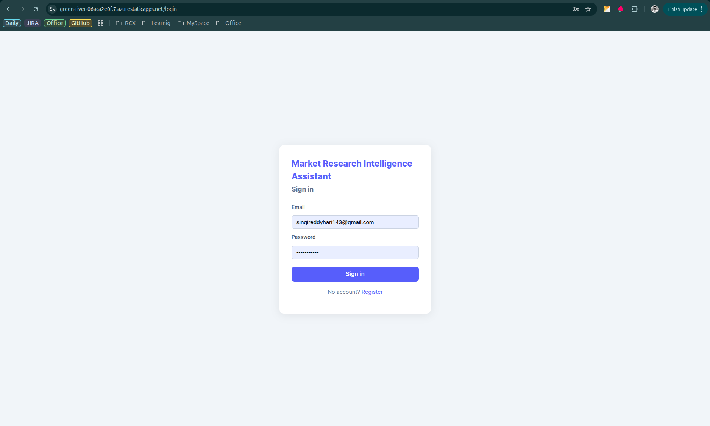
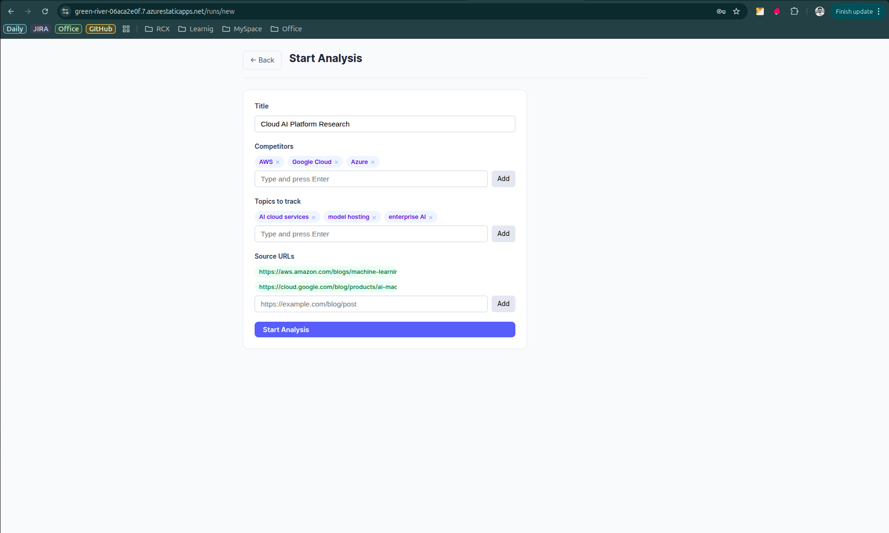
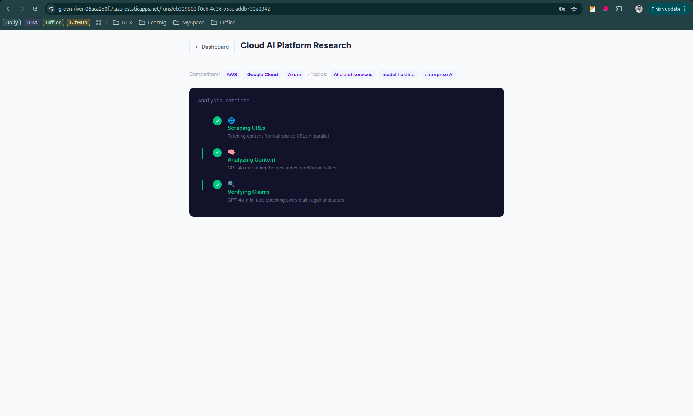
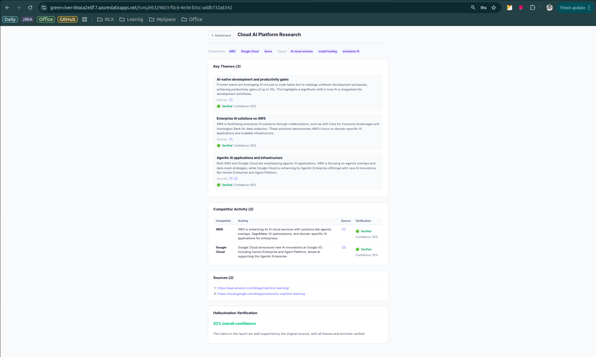
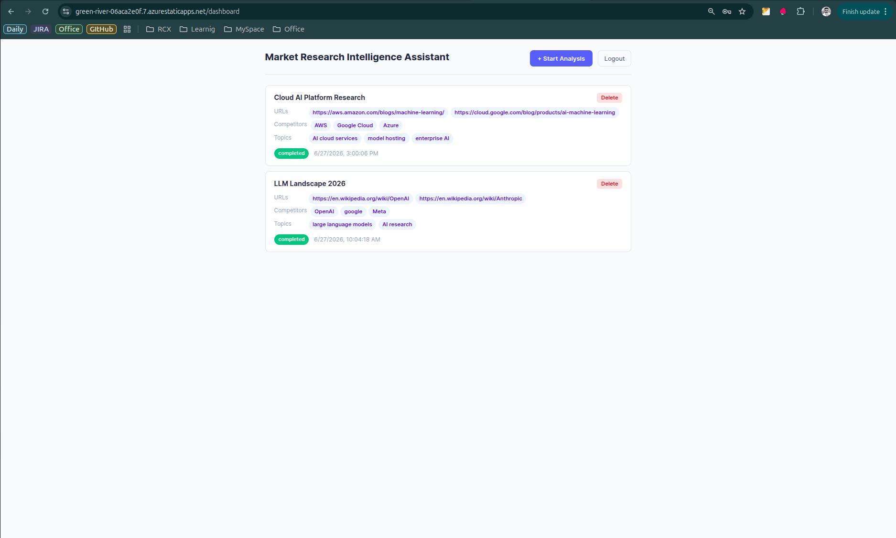
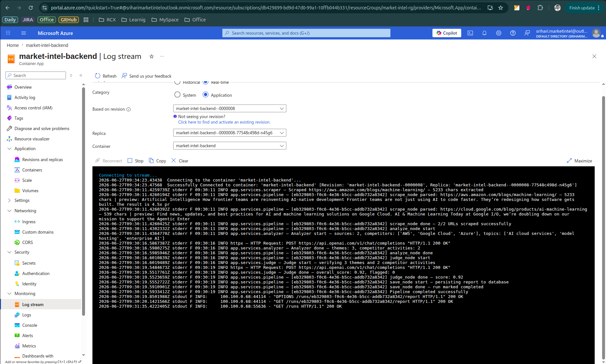
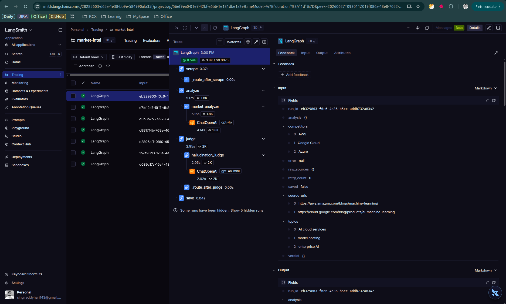
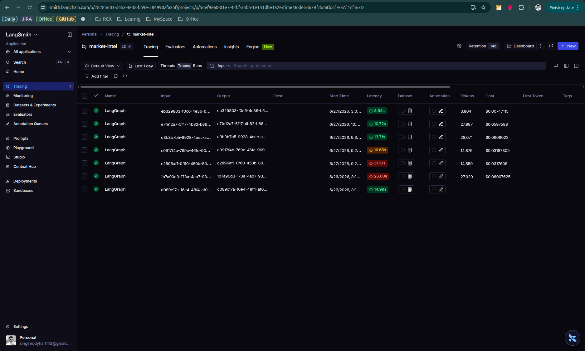

# Market Research Intelligence Assistant

An AI-powered platform that turns raw competitor URLs into structured market intelligence reports — with live pipeline streaming, per-claim hallucination verification, and full LLM observability.

---

## Business Use Case & Solution

**Problem:** Strategy and product teams spend hours manually reading competitor blogs, press releases, and product pages to track market shifts. The process is slow, inconsistent, and hard to scale.

**Solution:** Paste up to 10 URLs. The platform scrapes them in parallel, extracts key themes and competitor activities using GPT-4o, then fact-checks every single claim against the original sources using a second LLM judge. Results stream live to the browser. Each claim shows a 🟢 Verified or 🔴 Flagged badge with confidence score.

**Who it helps:**
- **Product Managers** — track what competitors shipped this week
- **Strategy teams** — identify emerging themes across 10 sources in under 2 minutes
- **Sales teams** — get a quick competitive briefing before a call
- **Researchers** — extract structured data from unstructured web content at scale

---

## Architecture

```
Browser (React + Vite + TypeScript)
  │
  ├── REST (axios + 401 interceptor) ──────────► FastAPI (Python 3.11)
  │                                                    │
  └── SSE stream (fetch + ReadableStream) ──────►  /runs/{id}/stream
                                                        │
                                              LangGraph StateGraph
                                         ┌──────────────────────────┐
                                         │  scrape_node             │ ← asyncio.gather (parallel)
                                         │       ↓                  │
                                         │  analyze_node            │ ← GPT-4o + wrap_openai
                                         │       ↓                  │
                                         │  judge_node              │ ← GPT-4o-mini + wrap_openai
                                         │       ↓                  │
                                         │  overall_score < 0.7?    │
                                         │  retry ≤ 2× ────────────► re_analyze_node
                                         │       ↓                  │
                                         │  save_node               │ ← PostgreSQL (Supabase)
                                         └──────────────────────────┘
                                                        │
                                              LangSmith Dashboard
                                         (prompt / tokens / cost / latency)
```

**Deployment architecture:**

```
GitHub Actions CI/CD
  │
  ├── Docker Hub ──────────► Azure Container Apps  (backend, consumption tier)
  │
  └── Azure Static Web Apps (frontend, free tier)
            │
            └── Supabase PostgreSQL (free tier, 500MB)
```

---

## Tech Stack

| Layer | Technology |
|---|---|
| Backend | FastAPI 0.111, SQLAlchemy 2.0 async, asyncpg, Alembic |
| AI Orchestration | LangGraph 0.2, LangChain Core 0.3 |
| LLM | OpenAI GPT-4o (analyzer) + GPT-4o-mini (judge) |
| Web Parsing | Trafilatura (primary), BeautifulSoup4 (fallback) |
| Observability | LangSmith — `@traceable` + `wrap_openai` (token/cost visible) |
| Frontend | React 18, Vite 5, TypeScript, React Router 6 |
| Database | PostgreSQL 15 via Supabase (asyncpg, SSL) |
| Auth | JWT (python-jose), bcrypt 4.0.1, slowapi rate limiting |
| Containerization | Docker, Docker Hub |
| CI/CD | GitHub Actions |
| Cloud | Azure Container Apps (backend) + Azure Static Web Apps (frontend) |

---

## Prerequisites

| Tool | Version | Install |
|---|---|---|
| Python | 3.11+ | [python.org](https://python.org) |
| Node.js | 18+ | [nodejs.org](https://nodejs.org) |
| Docker Desktop | latest | [docker.com](https://docker.com) |
| Git | any | [git-scm.com](https://git-scm.com) |
| OpenAI API Key | — | [platform.openai.com](https://platform.openai.com) |

Optional (for tracing):
- LangSmith account + API key — [smith.langchain.com](https://smith.langchain.com)

---

## Local Run

### Option A — Docker Compose (fastest)

```bash
# 1. Clone
git clone https://github.com/srihari000/market-intel.git
cd market-intel

# 2. Create .env
cp .env.example .env
# Fill in OPENAI_API_KEY and JWT_SECRET_KEY
```

Edit `.env`:
```env
DATABASE_URL=postgresql+asyncpg://market:market@db:5432/market
OPENAI_API_KEY=sk-proj-...
OPENAI_ANALYZER_MODEL=gpt-4o
OPENAI_JUDGE_MODEL=gpt-4o-mini
JWT_SECRET_KEY=any-random-string-at-least-32-chars
CORS_ORIGINS=http://localhost:5173

# Optional — LangSmith tracing
LANGSMITH_TRACING=true
LANGSMITH_API_KEY=lsv2_pt_...
LANGSMITH_PROJECT=market-intel
```

```bash
# 3. Start all services
docker compose up --build

# Backend:  http://localhost:8000
# Frontend: http://localhost:5173
```

### Option B — Without Docker (hot-reload development)

**Step 1 — Backend:**
```bash
cd backend
python3 -m venv .venv
source .venv/bin/activate        # Windows: .venv\Scripts\activate
pip install -r requirements.txt

# Export env vars
export $(grep -v '^#' ../.env | xargs)

# Run migrations
alembic upgrade head

# Start with hot-reload
uvicorn app.main:app --reload --port 8000
```

**Step 2 — Frontend:**
```bash
cd frontend
npm install
npm run dev     # http://localhost:5173
```

---

## Environment Variables

| Variable | Required | Description |
|---|---|---|
| `DATABASE_URL` | Yes | PostgreSQL connection string (asyncpg format) |
| `OPENAI_API_KEY` | Yes | OpenAI API key |
| `OPENAI_ANALYZER_MODEL` | No | Analyzer model (default: `gpt-4o`) |
| `OPENAI_JUDGE_MODEL` | No | Judge model (default: `gpt-4o-mini`) |
| `JWT_SECRET_KEY` | Yes | Secret for JWT signing (min 32 chars) |
| `CORS_ORIGINS` | No | Comma-separated allowed origins (default: `http://localhost:5173`) |
| `LANGSMITH_TRACING` | No | `true` to enable LangSmith tracing |
| `LANGSMITH_API_KEY` | No | LangSmith API key |
| `LANGSMITH_PROJECT` | No | LangSmith project name (default: `market-intel`) |

> **Never commit `.env` to git.** It is in `.gitignore`.

---

## Production Deployment (Azure)

Full step-by-step guide: [`/AI/AZURE_DEPLOY_GUIDE.md`](../AZURE_DEPLOY_GUIDE.md)

### Summary

| Resource | Service | Tier |
|---|---|---|
| PostgreSQL | Supabase | Free (500MB) |
| Backend | Azure Container Apps | Consumption (scales to zero) |
| Frontend | Azure Static Web Apps | Free |
| Container registry | Docker Hub | Free (public) |
| CI/CD | GitHub Actions | Free (2000 min/month) |

### GitHub Secrets required

| Secret | Value |
|---|---|
| `DOCKERHUB_USERNAME` | Docker Hub username |
| `DOCKERHUB_TOKEN` | Docker Hub access token (Read & Write) |
| `AZURE_CREDENTIALS` | JSON from `az ad sp create-for-rbac` |
| `AZURE_RESOURCE_GROUP` | e.g. `market-intel-rg` |
| `AZURE_CONTAINER_APP_NAME` | e.g. `market-intel-backend` |
| `VITE_API_URL` | Container App URL (no trailing slash) |
| `AZURE_STATIC_WEB_APPS_API_TOKEN` | From Azure Static Web App → Manage deployment token |

### Deploy

```bash
git push origin main
# GitHub Actions handles: build → push Docker → deploy backend → deploy frontend
```

Watch at: `github.com/srihari000/market-intel/actions`

---

## Current Features

### AI Pipeline
- **Parallel scraping** — `asyncio.gather` scrapes all URLs concurrently; Trafilatura extracts clean article text; BeautifulSoup4 fallback; SSRF protection blocks private IPs and AWS metadata endpoint
- **LangGraph orchestration** — `StateGraph` with 5 nodes: `scrape → analyze → judge → re_analyze → save`; conditional retry if hallucination score < 0.7 (max 2 retries)
- **GPT-4o analyzer** — extracts key market themes and competitor activities from scraped content; topics treated as broad domain filters not keyword matches
- **GPT-4o-mini judge** — verifies every claim against original sources; returns indexed per-claim verdicts (`theme_verdicts[]`, `activity_verdicts[]`) with `status`, `confidence`, and `reason`

### Hallucination Verification UI
- Inline 🟢 **Verified** / 🔴 **Flagged** badge on every theme card and competitor activity row
- Confidence percentage per claim
- Reason shown for flagged claims
- Overall confidence score with color coding (green ≥90%, amber ≥70%, red <70%)

### Live Streaming
- Server-Sent Events stream pipeline progress step by step to the browser
- Progress messages: scrape count, re-analysis attempt number, final confidence %
- Frontend uses `fetch` + `ReadableStream` to read the SSE stream; JWT passed as `?token=` query param

### CI/CD Pipeline
- GitHub Actions workflow: build Docker image → push to Docker Hub → deploy backend to Azure Container Apps → build and deploy frontend to Azure Static Web Apps
- Triggered automatically on every push to `main`
- Backend and frontend deploy in parallel (independent jobs)
- Frontend build injects `VITE_API_URL` at build time from GitHub Secrets

### Observability
- LangSmith `@traceable` on analyzer and judge agents
- `wrap_openai` wraps the OpenAI client so token usage and cost appear in LangSmith
- Full prompt/response/latency trace per run at [smith.langchain.com](https://smith.langchain.com)

### Security
| Layer | Implementation |
|---|---|
| SSRF protection | Async DNS resolution; blocks RFC1918, link-local, AWS metadata IPs; validates every redirect hop |
| Prompt injection | Sanitizes user inputs and scraped content; strips role prefixes and injection patterns |
| Token budget | tiktoken-accurate token counting; truncates sources to 124k token context window |
| Auth | bcrypt password hashing; JWT 24h expiry; rate limiting (10 login/min, 5 register/min per IP) |
| Input validation | URL scheme enforcement; max 10 URLs, 20 competitors; password complexity policy |
| LLM output validation | Pydantic validates every LLM response; score clamped to [0,1]; fallback on malformed JSON |
| Container security | Non-root user in Docker; `.dockerignore` excludes `.env` and test files |
| Response headers | `X-Content-Type-Options`, `X-Frame-Options`, `X-XSS-Protection`, `Referrer-Policy`, `Cache-Control: no-store` |

### API Reference

| Method | Endpoint | Auth | Description |
|---|---|---|---|
| POST | `/auth/register` | No | Register (5/min per IP) |
| POST | `/auth/login` | No | Login, returns JWT (10/min per IP) |
| GET | `/auth/me` | JWT | Current user info |
| POST | `/runs` | JWT | Create analysis run |
| GET | `/runs` | JWT | List all runs |
| GET | `/runs/{id}` | JWT | Get run status |
| GET | `/runs/{id}/stream` | `?token=` | SSE pipeline progress stream |
| GET | `/runs/{id}/report` | JWT | Fetch completed report |
| DELETE | `/runs/{id}` | JWT | Delete run |
| GET | `/health` | No | Health check |

---

## Future Enhancements

### BYOK — Bring Your Own Key
Allow users to enter their own OpenAI API key per session or per account. The key is stored encrypted at rest (AES-256) and used only for that user's pipeline runs. Enables teams to use their own Azure OpenAI endpoints or different model tiers without touching server config.

### Vector Database / RAG
Enable `pgvector` on the existing Supabase PostgreSQL. At ingest time, chunk each scraped document and store embeddings. At query time, retrieve only the top-K relevant chunks before passing to GPT-4o — instead of truncating everything to 124k tokens. Unlocks analysis of long documents (annual reports, 100-page whitepapers) currently cut off. Also enables a conversational follow-up interface: "What is OpenAI's pricing strategy?" answered from the stored report + source embeddings.

### Result Caching
Cache completed analysis results by `SHA256(sorted_urls + sorted_competitors + sorted_topics)` with a configurable TTL (default 1 hour). Store in Redis or PostgreSQL. If a user submits the same query within TTL, return instantly without calling OpenAI. Eliminates duplicate spend — a query repeated 10 times a day saves ~90% of token cost for that query.

### Background Job Queue
Move the LangGraph pipeline out of the request-response cycle into a Celery + Redis task queue. API returns a `run_id` immediately; a worker picks up the job asynchronously. Benefits: (1) frees uvicorn workers from long-running LLM calls, (2) supports horizontal scaling of workers independently from the API, (3) enables retry on worker crash without losing the run.

### Async Job Queue (Alternative: ARQ / FastAPI BackgroundTasks)
Lighter-weight alternative to Celery for Python async codebases. ARQ uses Redis for the queue but keeps everything in asyncio — no separate process model needed. Easier to deploy on Azure Container Apps where you want a single container type.

### Scheduled / Recurring Analysis
Save a URL set + competitor list as a "Watch" with a cron schedule (e.g. every Monday 8am). The system auto-runs the pipeline, generates a diff report showing what changed since the last run, and sends an email/Slack notification. Useful for ongoing competitive monitoring without manual triggering.

### UI/UX Improvements
- Export report as PDF or Markdown
- Side-by-side source preview — click a claim to see the exact source paragraph it came from
- Run history with search and filter by date, competitor, or topic
- Dark mode
- Mobile-responsive layout
- Shareable report links (public read-only view)

### Multi-model Support
Add a model selector in the UI: GPT-4o, GPT-4o-mini, Claude 3.5 Sonnet, Gemini 1.5 Pro. Each model routed through a common adapter interface. Enables cost vs. quality tradeoff per run. Combined with BYOK, users can bring any provider key.

### Team / Multi-tenant
Workspace model — multiple users under one organization share runs and reports. Role-based access: admin, analyst, viewer. Audit log of all runs and report accesses.

---

## Screenshots

### CI/CD Pipeline — GitHub Actions


### Login


### Run Form


### Pipeline Running


### Analysis Results


### Dashboard


### Azure Application Logs


### LangSmith Trace


### LangSmith Dashboard


---

## Project Structure

```
market-intel/
├── backend/
│   ├── app/
│   │   ├── config.py          # Pydantic settings from env vars
│   │   ├── database.py        # Async SQLAlchemy engine + session
│   │   ├── main.py            # FastAPI app, CORS, security headers
│   │   ├── models/            # SQLAlchemy ORM models (User, Run, Report)
│   │   ├── routers/           # auth.py, runs.py
│   │   ├── schemas/           # Pydantic schemas (auth, run, report, llm)
│   │   ├── services/
│   │   │   ├── analyzer.py    # GPT-4o market analyst
│   │   │   ├── judge.py       # GPT-4o-mini hallucination judge
│   │   │   ├── pipeline.py    # LangGraph StateGraph orchestration
│   │   │   └── scraper.py     # async httpx + Trafilatura scraper
│   │   └── utils/
│   │       ├── llm_guard.py   # prompt injection sanitization + token budget
│   │       ├── retry.py       # exponential backoff decorator for LLM calls
│   │       ├── security.py    # JWT + bcrypt helpers
│   │       └── limiter.py     # slowapi rate limiter
│   ├── alembic/               # DB migrations
│   ├── Dockerfile
│   └── requirements.txt
│
├── frontend/
│   ├── src/
│   │   ├── components/
│   │   │   ├── ReportViewer.tsx     # themes + activities + inline verdict badges
│   │   │   └── StreamProgress.tsx   # animated 3-stage pipeline progress tracker
│   │   ├── pages/
│   │   │   ├── Login.tsx            # auth — sign in
│   │   │   ├── Register.tsx         # auth — create account
│   │   │   ├── Dashboard.tsx        # list of all runs
│   │   │   ├── NewRun.tsx           # create analysis run form
│   │   │   └── RunDetail.tsx        # live stream + completed report view
│   │   ├── types/index.ts           # TypeScript interfaces
│   │   └── api/client.ts            # axios instance + interceptors + runsApi
│   ├── public/
│   │   └── staticwebapp.config.json  # Azure SPA routing fallback
│   └── package.json
│
├── .github/
│   └── workflows/deploy.yml   # CI/CD: test → build → push → deploy
├── docker-compose.yml
├── .env.example
└── README.md
```
